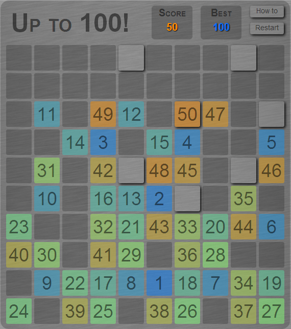

# Up to 100!

Up to 100! is a simple yet challenging game.

You can <a href="http://chosko.github.io/upto100" target="_blank" >PLAY HERE!</a>

### Goal

The goal is to fill the whole grid with the numbers from 1 to 100.

### Filling the grid

Each turn you can move from the preceding number by jumping 2 tiles horizontally or vertically, or jumping 1 tile diagonally. 
During all the game the tiles you can select are already highlighted.
If a tile is already filled, you can't refill it.

###End of the game

The game ends when all the spots in which you can move are already filled.
You win when you fill the whole grid up to 100.

###Controls

__Keyboard__: Use the arrow keys to select the next move. To move diagonally use two arrow keys simultaneously.

__Mouse__: Click on the tile you want to fill.

###Credits

The game was created by <a href="https://github.com/Chosko" target="_blank">Ruben Caliandro</a>.

It is an open-source project released under the MIT License (MIT).